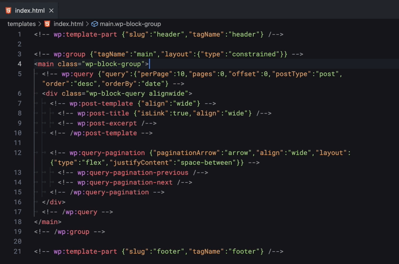

# VSCode WP Block HTML

This extension assists coding of unique HTML including [Block markups](https://developer.wordpress.org/themes/block-themes/templates-and-template-parts/) for WordPress block theme.

## Features

- Formatting for HTML including Block markup (powered by [Prettier](https://prettier.io/) and [prettier-plugin-wp-block-html](https://github.com/co6x0/prettier-plugin-wp-block-html))
- Snippets for Block markup
- Syntax highlighting



## Usage

Just install the extension to use Block markup syntax highlighting and snippets in your HTML files.

To use code formatting, you will need to change your user or workspace settings. (Mac: `⌘ + ,` | Win: `Ctrl + ,`)

If you want to always enable code formatting with the extension, add the following to your **User**'s `setting.json`.

```json
"[html]": {
	"editor.defaultFormatter": "co6x0.vscode-wp-block-html"
}
```

If you want to use it only for a specific project, add the same to your **Workspace** settings. (Your project root > `.vscode` > `settings.json`)

Also, if necessary, enable automatic formatting when saving files. ( `"editor.formatOnSave": true` )

For more information, please refer to [VScode documentation](https://code.visualstudio.com/docs/getstarted/settings).
